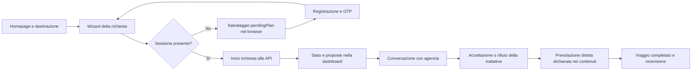
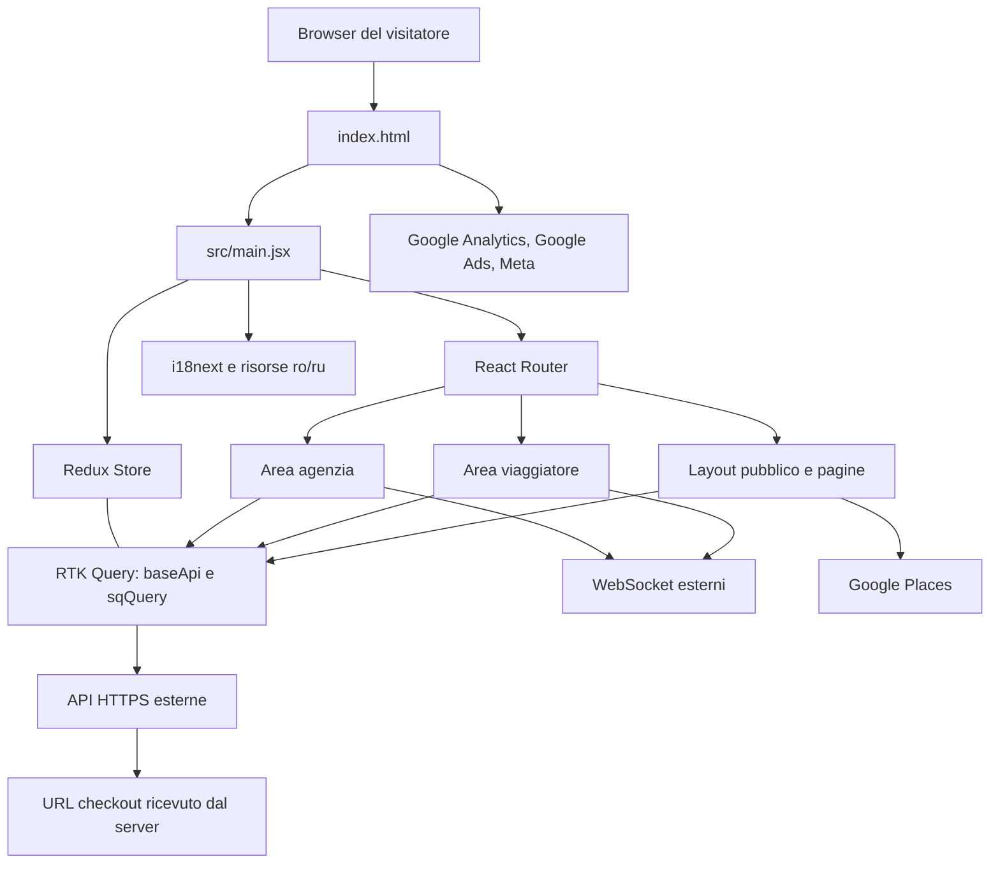
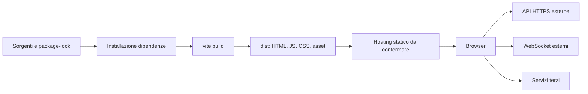

# VacanzaMyCost — Analisi della piattaforma, architettura e opportunità di business

**Data:** 30 settembre 2026  
**Repository:** `FreWork-Update`  
**Revisione Git di riferimento:** `da1807507b793f305793102bbdf2cbdfa6fae407`, branch `main`, con modifiche locali incluse nell'analisi.  
**Metodo:** interrogazione del grafo graphify esistente, inventario dell'intera repository, verifica dei sorgenti correnti, analisi dei collegamenti di importazione e build di produzione.  
**Destinatari:** proprietà, product management, marketing, responsabili commerciali, progettisti UX e sviluppo.  
**Finalità:** fornire una base documentata per studiare il business esistente e decidere quali miglioramenti verificare e realizzare.

## Indice

1. [Sintesi per le decisioni](#1-sintesi-per-le-decisioni)
2. [Perimetro, metodo e attendibilità](#2-perimetro-metodo-e-attendibilità)
3. [Scopo del progetto e modello di business](#3-scopo-del-progetto-e-modello-di-business)
4. [Pubblici, navigazione e percorsi](#4-pubblici-navigazione-e-percorsi)
5. [Catalogo delle funzionalità](#5-catalogo-delle-funzionalità)
6. [Architettura applicativa e dati](#6-architettura-applicativa-e-dati)
7. [Design, contenuti e localizzazione](#7-design-contenuti-e-localizzazione)
8. [Infrastruttura e deployment](#8-infrastruttura-e-deployment)
9. [Qualità, affidabilità e criticità](#9-qualità-affidabilità-e-criticità)
10. [Misurazione del business](#10-misurazione-del-business)
11. [Programma di ricerca e sperimentazione](#11-programma-di-ricerca-e-sperimentazione)
12. [Priorità e percorso di miglioramento](#12-priorità-e-percorso-di-miglioramento)
13. [Informazioni da acquisire](#13-informazioni-da-acquisire)
14. [Appendice: contratti API](#14-appendice-contratti-api)
15. [Appendice: mappa dei sorgenti e copertura](#15-appendice-mappa-dei-sorgenti-e-copertura)
16. [Appendice: risultati graphify e verifiche](#16-appendice-risultati-graphify-e-verifiche)

## 1. Sintesi per le decisioni

Il progetto implementa il **frontend di un marketplace di richieste di viaggio**. Il viaggiatore descrive la vacanza e il budget; le agenzie consultano le richieste, inviano proposte e proseguono la trattativa attraverso conversazioni associate al viaggio. La piattaforma comprende acquisizione pubblica, registrazione, aree riservate, gestione delle offerte, messaggistica, recensioni e avvio del checkout degli abbonamenti.

La proposta commerciale dichiarata privilegia **qualità delle richieste e selezione dei partner**: verifica manuale, massimo tre agenzie per richiesta, accesso delle agenzie su candidatura, servizio gratuito ai viaggiatori e assenza di commissioni sulle vendite. Il ricavo supportato dall'interfaccia è l'abbonamento delle agenzie. La prenotazione e il pagamento del viaggio sono descritti nei contenuti come rapporto diretto con l'agenzia. Queste promesse sono documentate nel prodotto, ma la repository non permette di dimostrarne l'applicazione operativa o i risultati economici. Fonti: [traduzioni romene](src/translation/ro/translation.json), [traduzioni russe](src/translation/ru/translation.json), [offerta per agenzie](src/Pages/Home/Pricing.jsx), [adattamento dei contenuti commerciali](src/lib/localizedContent.js).

L'architettura è una **Single Page Application React**, costruita con Vite, che comunica con un backend esterno attraverso API HTTPS e WebSocket. Non sono presenti il codice del backend, uno schema del database, configurazioni dei server applicativi o un sistema di moderazione del gestore. L'area `/admin` è l'area operativa delle **agenzie**, non una console dimostrata di amministrazione dell'intera piattaforma.

La base funzionale è ampia, ma alcune incongruenze possono incidere sul business prima di qualunque ampliamento del prodotto:

| Priorità decisionale | Evidenza nella repository | Implicazione da valutare |
|---|---|---|
| Rendere affidabile l'acquisizione | Il modulo contatti non trasmette i dati; alcuni link di condivisione sono di sviluppo | Richieste di assistenza e traffico condiviso possono non raggiungere il flusso previsto |
| Rendere misurabile il percorso | Tracker presenti, ma consenso scollegato dall'avvio e un evento denominato `apertura_popup` emesso dopo l'invio | I dati raccolti e i nomi degli eventi non costituiscono ancora un funnel verificato |
| Stabilire il mercato e l'identità | Interfaccia attiva in romeno e russo; dominio, percorsi, requisiti fiscali e diversi contenuti riferiti all'Italia | Va chiarito il pubblico servito e resa coerente la promessa in ciascuna lingua |
| Verificare il valore offerto alle agenzie | Abbonamenti e messaggi su lead verificati presenti; limiti e selezione dipendono da sistemi esterni | Prima di aumentare l'acquisizione dei partner serve misurare qualità, distribuzione e resa delle richieste |
| Consolidare le basi tecniche | Build riuscita, bundle consistente, lint non disponibile, controlli delle route disomogenei | Migliorare affidabilità e velocità facilita sia l'esperienza sia l'evoluzione del prodotto |

Il documento propone una sequenza: **correggere le discrepanze osservate, misurare il percorso completo, validare qualità e sostenibilità del servizio, quindi sperimentare crescita e nuove funzionalità**. Le priorità sono valutazioni basate sul codice, non una stima dimostrata del ritorno economico.

## 2. Perimetro, metodo e attendibilità

### 2.1 Cosa è stato analizzato

L'inventario, effettuato prima della creazione di questo documento, comprende **137 file di progetto**, esclusi `.git`, `node_modules`, `dist` e gli output graphify. Comprende 72 file JSX, 6 TSX, 7 JS, 1 TS, 15 JSON, CSS, HTML, documentazione, configurazioni e risorse grafiche. Dentro `src` sono presenti **84 file JS/JSX/TS/TSX**, per **19.502 righe** contando anche commenti e righe vuote. Le dimensioni indicano il perimetro, non la qualità del prodotto.

Sono stati verificati in particolare: ingresso dell'applicazione, tutte le famiglie di pagine, configurazione delle route, client API, WebSocket, flussi di autenticazione, creazione richieste, offerte, abbonamenti, traduzioni, CSS, asset referenziati, configurazioni di build e pubblicazione. L'inventario delle definizioni API contiene **60 definizioni RTK Query**, comprese quelle duplicate o non utilizzate dalle schermate attive.

### 2.2 Criteri di esclusione

“Scartare” significa escludere materiale non utile dall'analisi architetturale, senza cancellare file.

| Materiale | Trattamento | Motivazione |
|---|---|---|
| `.git/` | Escluso dal contenuto; letti revisione e stato | La cronologia completa non serve a descrivere lo stato corrente |
| `node_modules/` | Escluso come corpus; utilizzato per la build | Codice di terzi e artefatti installati |
| `dist/` | Escluso come fonte; build separata in `/tmp` | Output generato, potenzialmente precedente alle modifiche correnti |
| `graphify-out/` | Consultato come mappa storica e diagnostica | Evita di considerare gli output dell'analisi come funzionalità del sito |
| `package-lock.json` | Considerato per la riproducibilità, senza trascrivere le dipendenze transitive | Grande quantità di dettagli non utili al modello di business |
| `.vscode/` e README del template | Classificati, peso ridotto | Configurazione editor e documentazione generica |
| Animazioni JSON, immagini e GIF | Considerate per ruolo, riferimenti e peso | I dati interni di animazioni e bitmap non descrivono regole commerciali |
| Componenti senza collegamenti dall'ingresso | Segnalati separatamente | La presenza di un file non prova che la funzione sia disponibile agli utenti |

Non sono state modificate le funzionalità applicative e non sono state eseguite operazioni di pubblicazione, registrazione, pagamento o scrittura sul backend.

### 2.3 Come leggere le conclusioni

- **Osservato:** codice, configurazione o risultato di un comando locale.
- **Dichiarato:** promessa contenuta in testi e traduzioni; richiede conferma delle regole operative.
- **Inferito:** interpretazione architetturale o commerciale motivata dalle evidenze.
- **Da verificare:** comportamento dipendente da backend, account dei fornitori, utenti o dati aziendali non presenti.

Le funzionalità con una chiamata API sono **implementate lato frontend**, non automaticamente certificate come funzionanti in produzione. Non sono stati eseguiti test con account reali, verifiche DNS/hosting, audit del backend, navigazione visuale su dispositivi o analisi dei dati di marketing. La valutazione del design deriva da markup, CSS, componenti e asset referenziati.

### 2.4 Uso e limiti di graphify

È stato riutilizzato il grafo del 25 settembre 2026, seguendo il percorso previsto dalla skill per un grafo già presente. Contiene **419 nodi, 567 archi, 92 comunità e 120 percorsi sorgente distinti**. Le query hanno orientato la ricostruzione delle dipendenze; le conclusioni sullo stato corrente sono state confrontate con i sorgenti.

Il confronto degli hash individua **63 file esistenti diversi dal manifest storico**. Alcuni file attuali non sono rappresentati, fra cui `AuthLayout.jsx`, `LegalLayout.jsx`, `localizedContent.js`, le traduzioni `ro` e `ru` e `src/index.css`. Inoltre la diagnostica originaria registra **523 archi con estremi mancanti nell'estrazione**, su 1.090 relazioni grezze. Gli archi validi confluiti nel grafo sono 567. Questo limita la completezza della mappa; non significa che esistano 523 errori nell'applicazione.

Il grafo non è stato rigenerato né presentato come aggiornato. Il report integra le sue indicazioni con l'analisi corrente. Il costo in token dell'estrazione storica è **non disponibile**: gli zeri di `cost.json` sono segnaposto esplicitamente dichiarati, non costo nullo. Anche per questa analisi non è disponibile una misurazione separata dei token da attribuire al documento. Fonti: [grafo](graphify-out/graph.json), [report storico](graphify-out/GRAPH_REPORT.md), [diagnostica](graphify-out/graph_health.json), [costo storico](graphify-out/cost.json).

## 3. Scopo del progetto e modello di business

### 3.1 Problema affrontato

Per il viaggiatore, la piattaforma cerca di ridurre la fatica di descrivere lo stesso viaggio a più interlocutori, confrontare proposte e trovare un professionista affidabile. Per l'agenzia, cerca di ridurre il tempo speso su richieste poco concrete, offrendo accesso a domanda selezionata.

La struttura è quella di un **marketplace guidato dalla domanda**: l'oggetto iniziale è la richiesta del cliente, non un catalogo di pacchetti immediatamente acquistabili. Il budget e i requisiti precedono le offerte. La conversazione serve a trasformare una proposta in una relazione commerciale.

### 3.2 Proposta di valore e relativa evidenza

| Promessa | Evidenza | Cosa resta da provare |
|---|---|---|
| Viaggio costruito sui desideri e sul budget | Moduli con destinazione, date, partecipanti, budget, preferenze e note | Qualità delle proposte e soddisfazione del cliente |
| Richieste verificate manualmente | FAQ, copy commerciale, campi di approvazione e conferma | Processo di verifica, operatori, tempi, criteri e controlli server |
| Agenzie selezionate | Candidatura, stato di attesa, badge e profilo aziendale | Validazione documentale, aggiornamento delle verifiche e responsabilità |
| Massimo tre agenzie per richiesta | Testi FAQ e funzionalità commerciali dei piani | Assegnazione, concorrenza simultanea e limite applicato dal backend |
| Gratuità per il viaggiatore | FAQ e comunicazione pubblica | Condizioni economiche reali e possibili eccezioni |
| Nessuna commissione sulle vendite | Copy dei piani e FAQ | Contratti effettivi con i partner |
| Contatto diretto e prenotazione con l'agenzia | FAQ e contenuti dei piani | Come viene registrata la vendita conclusa fuori piattaforma |
| Contatti personali protetti fino alla scelta | Copy pubblico | Campi restituiti dalle API, permessi e momento dello sblocco |
| Risposte/revisione in 24–48 ore | Traduzioni e pagina di attesa | Tempi effettivi misurati e copertura nei periodi di picco |

Fonti principali: [FAQ](src/Pages/Home/Faq.jsx), [come funziona](src/Pages/Home/WhoItWork.jsx), [contenuti commerciali](src/lib/localizedContent.js), [scheda richiesta](src/components/created-plan-card.jsx).

### 3.3 Segmenti e geografia

I ruoli espliciti sono `tourist` e `agency`. Le categorie di domanda comprendono mare, montagna, relax e gruppi; i moduli distinguono anche tipologie di viaggio e sistemazioni. La proposta può servire clienti che cercano consulenza e personalizzazione, ma **non ci sono dati per stabilire quale segmento generi il maggior valore**.

Lo stato corrente presenta una scelta geografica da chiarire: lingue `ro` e `ru`, prezzi visualizzati in euro, dominio `.it`, URL italiani, FAQ sulle agenzie italiane e validazione della partita IVA a 11 cifre. È possibile che si vogliano servire viaggiatori romenofoni e russofoni attraverso agenzie italiane; questa è un'ipotesi coerente con gli elementi osservati, non una strategia dimostrata dalla repository.

### 3.4 Ricavi e costi

L'interfaccia legge i piani dal backend e avvia una sessione di checkout mediante `price_id`, per poi aprire `checkout_url`. I contenuti distinguono candidatura, partner fondatore e partner standard; la promessa fondatori cita i primi 20 partner approvati e un prezzo bloccato.

**Non è possibile ricavare un listino affidabile dal solo codice.** Prezzi, disponibilità e condizioni operative arrivano dall'API. Il controllo di una stringa contenente `129` in `AdminPricing.jsx` è una regola di stile, non prova del prezzo corrente. I riferimenti a Stripe/PayPal nei testi non dimostrano quale fornitore gestisca davvero il checkout.

Le principali voci di costo da misurare sono acquisizione dei viaggiatori, acquisizione e assistenza alle agenzie, verifica manuale, gestione delle controversie, sviluppo, hosting/API, archiviazione dei media, email e servizi esterni come Places. Gli importi non sono disponibili.

### 3.5 Risorsa distintiva e vincolo di crescita

L'ipotesi strategica più rilevante è che il valore dipenda dalla **qualità e distribuzione delle richieste**. Aumentare il numero di agenzie senza aumentare domanda qualificata e capacità di selezione può ridurre il valore percepito dell'abbonamento. Aumentare il traffico senza capacità di risposta può indebolire la promessa ai viaggiatori.

La verifica manuale è quindi sia un possibile elemento distintivo sia un vincolo operativo. Per valutarla servono tempi di lavorazione, tassi di scarto, motivazioni, capacità giornaliera e relazione fra verifica e conversione effettiva.

## 4. Pubblici, navigazione e percorsi

### 4.1 Aree del sito

| Area | Destinatari | Funzione |
|---|---|---|
| Pubblica | Visitatori, viaggiatori, agenzie | Acquisizione, spiegazione del servizio, richieste, directory, blog e condizioni |
| Autenticazione | Nuovi utenti e utenti di ritorno | Registrazione per ruolo, login, OTP e recupero password |
| `/user` | Viaggiatori | Richieste proprie, proposte, preferiti, chat, recensioni e profilo |
| `/admin` | Agenzie | Consultazione della domanda, invio offerte, trattative, profilo e abbonamento |
| Gestione centrale | Non rappresentata come console in questa repo | Moderazione, selezione partner, verifica richieste e gestione complessiva da ricostruire altrove |

### 4.2 Mappa delle route

La tabella descrive la configurazione effettiva di [routes.jsx](src/routes/routes.jsx), inclusi nomi che non corrispondono perfettamente alla schermata.

| Percorso | Componente / comportamento |
|---|---|
| `/` | `Home`: proposta, ricerca destinazione, wizard, richieste, agenzie e passaggi del servizio |
| `/richieste` | `TourPlanDouble`: catalogo delle richieste con filtri e offerte |
| `/crea-richiesta` | `TourPlan`: pagina di richieste e interazioni; non coincide con il wizard principale della homepage |
| `/richieste/:id` | `SinglePost`: dettaglio richiesta e azioni commerciali |
| `/tutte-le-richieste` | `ViewAllPost`: ulteriore elenco richieste |
| `/offerte-accettate` | `AcceptedOffers`: richieste completate restituite dal servizio pubblico |
| `/agenzie-certificate` | `Membership`: directory, ricerca, profili, recensioni e preferiti |
| `/per-agenzie` | `Pricing`: candidatura o piani di abbonamento |
| `/come-funziona` | `WhoItWork` con FAQ |
| `/blog`, `/blog/:id` | Elenco e dettaglio; `:id` viene interpretato come slug |
| `/contatti` | Form contatti, attualmente privo di invio al server |
| `/privacy-policy`, `/termini-e-condizioni` | Documenti informativi |
| `/registrazione`, `/login` | Creazione account e accesso |
| `/verifica-account`, `/verifica-otp`, `/recupero-password` | Richiesta recupero, verifica OTP e impostazione password |
| `/registrazione-completata`, `/successo` | Stesso componente `SubscriptionSuccess` |
| `/in-attesa` | Messaggio di attesa per la candidatura dell'agenzia |
| `/user` | Richieste create |
| `/user/richieste-pubblicate`, `/user/richieste-accettate`, `/user/preferiti` | Sezioni personali del viaggiatore |
| `/user/dashboard` | Layout della sezione richieste |
| `/user/crea-richiesta`, `/user/modifica-richiesta` | Modulo `CreatePlan`; la modifica dipende dallo stato di navigazione |
| `/user/profilo`, `/user/modifica-profilo` | Profilo viaggiatore |
| `/user/chat`, `/user/chat/:id` | Elenco conversazioni e messaggi |
| `/user/notification` | Componente notifiche condiviso |
| `/admin`, `/admin/dashboard` | Dashboard richieste, offerte, accettate e rifiutate |
| `/admin/profilo`, `/admin/modifica-profilo` | Profilo agenzia |
| `/admin/gestione-abbonamento` | Piani e avvio checkout |
| `/admin/notifiche` | Notifiche |
| `/admin/chat`, `/admin/chat/:id` | Conversazioni e messaggi condivisi con l'area viaggiatore |

Sono presenti due blocchi `/user`, uno con `PrivateRoute` e uno senza, oltre a duplicazioni delle route di autenticazione. L'`errorElement` del layout pubblico reindirizza alla homepage: può nascondere la distinzione fra pagina mancante ed errore di caricamento/rendering. Questi aspetti meritano una razionalizzazione e una verifica in navigazione reale.

### 4.3 Percorso del viaggiatore



Il wizard usa sei valori di step interni, presentati in **tre fasi visibili**. Raccoglie destinazione, date, adulti/bambini, budget, preferenze e contatti. Una bozza anonima viene conservata in `localStorage` come `pendingPlan`; il codice tenta di riprenderla al ritorno sulla homepage. Il flusso va verificato su refresh, cambio dispositivo, OTP e sessione scaduta: `localStorage` vale solo per quel browser e l'allegato non è preservato come normale file da una serializzazione JSON.

Fonti: [Banner](src/Pages/Home/Banner.jsx), [wizard](src/Pages/Home/BannerSectionPupup.jsx), [registrazione](src/Pages/Authentication/Registration.jsx), [OTP](src/Pages/Authentication/OTP_Verification.jsx).

### 4.4 Percorso dell'agenzia

1. Consultazione della proposta per partner e candidatura.
2. Registrazione con ruolo agenzia, dati aziendali, OTP e schermata di attesa.
3. Completamento del profilo, logo, copertina e categorie di servizio.
4. Accesso a richieste e strumenti in funzione degli stati restituiti dal backend.
5. Consultazione/selezione di un piano e avvio del checkout, dove previsto.
6. Invio di budget, messaggio, eventuale sconto e allegato.
7. Conversazione, rifiuto/archiviazione o conferma della trattativa.
8. Consultazione delle offerte accettate e delle recensioni sul profilo.

La sequenza completa di approvazione e pagamento non può essere ricostruita come macchina a stati certa: la UI espone singoli passaggi, ma la relativa regola server non è nella repository. In particolare, nascondere voci di menu quando il profilo è incompleto non dimostra che le API impediscano le stesse operazioni.

## 5. Catalogo delle funzionalità

### 5.1 Acquisizione e contenuti pubblici

| Funzionalità | Implementazione osservata | Limite o nota |
|---|---|---|
| Homepage | Hero fotografica, input destinazione, CTA, argomenti di fiducia, richieste e agenzie | Nessuna prova di conversione reale disponibile |
| Autocompletamento destinazioni | Script Google Maps Places e autocomplete | Configurazione ripetuta in più componenti; dipendenza esterna |
| Richieste pubbliche | Lista, categorie, dettagli, conteggio offerte, ricerca e filtri | Filtri locali e server convivono in schermate diverse |
| Directory agenzie | Ricerca, elenco generale/top, logo, cover, categorie, rating e dialog di dettaglio | Certificazione visualizzata secondo i dati ricevuti |
| Social proof | Richieste completate, recensioni, badge | Non dimostra autonomamente vendite o prenotazioni pagate |
| Blog | Elenco, estratti, data, immagine e dettaglio per slug | Il dettaglio scarica l'elenco e cerca lo slug; HTML del contenuto inserito direttamente |
| FAQ e spiegazione del servizio | Contenuti localizzati, sette passaggi nella pagina dedicata | Le promesse operative vanno allineate al servizio reale |
| Contatti | Validazione campi, messaggio di successo e reset | **Nessuna trasmissione dei dati** |
| Condivisione e like | Mutazione di interazione e copia di un link | Almeno un percorso usa `localhost` e una route non definita |
| Privacy e condizioni | Pagine dedicate con struttura comune | Presente un segnaposto per la partita IVA in romeno |

### 5.2 Identità e account

Registrazione con ruoli `tourist`/`agency`, email e password; per l'agenzia vengono raccolti nome, telefono e partita IVA. È previsto un codice invito, ma non emerge un sistema completo di attribuzione premi o referral. Le condizioni sono accettate tramite checkbox; nel payload di registrazione non risultano inviati versione dei documenti e timestamp del consenso, che potrebbero essere gestiti altrove.

Il login memorizza access token, refresh token e alcuni dati del profilo nel browser. L'OTP memorizza i token, ma non replica tutta l'inizializzazione del profilo fatta dal login. Sono presenti reinvio OTP, recupero password, nuova password e modifica della password dall'area utente. Non emerge un gestore centralizzato del rinnovo della sessione mediante refresh token.

Fonti: [client pubblico](src/redux/features/baseApi.js), [Login](src/Pages/Authentication/Login.jsx), [Registration](src/Pages/Authentication/Registration.jsx), [OTP](src/Pages/Authentication/OTP_Verification.jsx), [UserDashboardLayout](src/Layout/User/UserDashboardLayout.jsx).

### 5.3 Richieste di viaggio

Le richieste possono essere create, modificate, eliminate e portate fra stato `draft` e `published`. La dashboard mostra anche informazioni di approvazione, fra cui valori come `In attesa` e `Rifiutato`. Stato editoriale, approvazione e conclusione della trattativa sono dimensioni diverse che oggi affiorano con nomenclature differenti.

Il modello raccolto dal wizard comprende:

| Gruppo | Campi osservati |
|---|---|
| Contatto | Nome, email, telefono |
| Viaggio | Destinazione, data iniziale/finale, luoghi di interesse |
| Partecipanti | Adulti, bambini, totale nei dati visualizzati |
| Budget | Importo; nel wizard valore iniziale 5.000 e slider 0–50.000 con passo 500 |
| Preferenze | Tipo di viaggio, categoria destinazione, sistemazione, stelle minime, trattamento pasti |
| Dettagli | Descrizione, immagine/allegato della destinazione |
| Workflow | Stato bozza/pubblicazione, conferma della richiesta, approvazione restituita dall'API |

Il valore iniziale di 5.000 è una scelta dell'interfaccia e **non dimostra il budget medio della clientela**. Il modulo separato `CreatePlan` ha un insieme di campi diverso dal wizard: per esempio non invia data finale e conteggi adulti/bambini nello stesso modo. La checkbox relativa al volo compare nello stato del wizard, ma non emerge un corrispondente campo nel payload esaminato. Queste differenze richiedono un unico contratto funzionale condiviso.

Fonti: [wizard](src/Pages/Home/BannerSectionPupup.jsx), [CreatePlan](src/Layout/User/CreatePlan.jsx), [card richiesta](src/components/created-plan-card.jsx).

### 5.4 Offerte e trattative

Le agenzie possono inviare importo, messaggio, sconto opzionale e, in alcuni flussi, un file. Sono presenti elenchi delle offerte inviate, delle accettate e delle richieste rifiutate; queste ultime possono essere ripristinate. La piattaforma consente di aprire una conversazione collegata alla richiesta.

Il codice contiene più livelli di accettazione: accettazione dell'offerta iniziale, conferma della proposta finale da parte dell'agenzia e risposta conclusiva del viaggiatore. Una lettura commerciale corretta deve quindi distinguere **interesse, trattativa, accordo dichiarato e prenotazione pagata**. La repository non documenta un incasso del viaggio.

Sono definite API dedicate a richiesta sconto, proposta di sconto e offerta finale nella conversazione. Tuttavia i componenti `OfferDiscount.tsx` e `FinalOffer.jsx` non risultano raggiungibili dagli import dell'ingresso corrente: non vanno contati come schermate attive soltanto perché esistono. Restano attivi gli sconti nei form offerta e le azioni di chiusura trattativa presenti nelle schermate collegate.

Fonti: [AdminHome](src/Layout/Admin/AdminHome.jsx), [offerte inviate](src/Layout/Admin/AdminOfferPlan.jsx), [messaggi](src/Layout/User/Messages.jsx), [client autenticato](src/redux/features/withAuth.js).

### 5.5 Chat e notifiche

La chat è condivisa dai due ruoli. Comprende lista conversazioni, ricerca per interlocutore/viaggio, inbox e archivio, messaggi di testo e allegati, indicatori di lettura, associazione alla richiesta e azioni di accettazione/rifiuto.

Il trasporto è ibrido: lo storico e l'invio passano dalle API HTTP; gli aggiornamenti dei messaggi arrivano via WebSocket; la lista conversazioni viene riletta ogni tre secondi. L'invio usa un messaggio locale provvisorio con stato `sending`, `sent` o `failed`, poi tenta la riconciliazione con la risposta del server.

Le notifiche dispongono di elenco, conteggio non letti, lettura e cancellazione. Esistono connessioni WebSocket separate per lista/notifiche e conteggio. Non è presente una strategia esplicita di riconnessione automatica progressiva dopo una disconnessione.

Fonti: [ChatInterface](src/Layout/User/ChatInterface.jsx), [Messages](src/Layout/User/Messages.jsx), [Socketurl](src/assets/Socketurl.js), [notifiche](src/Layout/Admin/AdminNotification.jsx).

### 5.6 Profili, reputazione e fidelizzazione

- Profilo viaggiatore visualizzabile e modificabile, con immagine e contatti.
- Profilo agenzia con dati aziendali, partita IVA, descrizione, categorie, logo e copertina; controlli sulla dimensione degli upload.
- Badge di verifica e indicatori di reputazione restituiti dalle API.
- Agenzie preferite, aggiunta/rimozione e lista personale.
- Richieste accettate distinte fra future e completate tramite `is_completed`.
- Recensioni con voto da una a cinque stelle e commento, collegate al piano di viaggio nella chiamata API.

Non emerge una gestione completa di segnalazione/contestazione recensioni, moderazione del contenuto o risposte dell'agenzia. Queste funzioni potrebbero esistere nel backend o negli strumenti operativi esterni.

### 5.7 Abbonamenti

Il client recupera i piani, mostra caratteristiche e CTA, distingue candidatura e acquisto e invia `price_id` al backend. Il frontend reindirizza alla pagina di checkout esterna ricevuta. Le pagine di successo sono presentazionali e non interrogano un endpoint di verifica del pagamento: aprire `/successo` non prova l'attivazione di un abbonamento.

Non risultano implementate qui una pagina completa di fatturazione, gestione dei metodi di pagamento, cancellazione/rinnovo o riconciliazione dei webhook. Per descrivere queste capacità è necessario esaminare il servizio abbonamenti esterno.

## 6. Architettura applicativa e dati

### 6.1 Componenti principali



Il diagramma mostra integrazioni osservate nel client; non descrive l'interno dei servizi esterni.

### 6.2 Stack

| Livello | Tecnologia osservata | Ruolo |
|---|---|---|
| UI | React 19 | Componenti, stato ed effetti |
| Build | Vite, plugin React | Server locale, trasformazione JSX, bundle statico |
| Routing | React Router 7 | Navigazione browser e layout annidati |
| Dati remoti | Redux Toolkit / RTK Query | Query, mutazioni, cache e invalidazione |
| Form | React Hook Form e stato locale | Raccolta dati e validazione |
| Stile | Tailwind CSS 4, DaisyUI, CSS globale | Utility, temi e componenti |
| Primitive | Radix, configurazione shadcn, class variance authority | Dialog, menu, pulsanti e varianti |
| Movimento/icone | Framer Motion, Lucide, React Icons | Transizioni e segnali visivi |
| Lingue | i18next, react-i18next, language detector | Risorse localizzate e preferenza lingua |
| Metadati | react-helmet-async e aggiornamento di `document.title` | Titoli delle schermate |
| Feedback | react-hot-toast e react-toastify | Notifiche di esito |

Le versioni maggiori sono quelle dichiarate in [package.json](package.json); la build locale ha utilizzato Vite **6.3.5**. Il file di configurazione TypeScript ammette JavaScript e disabilita `checkJs`; non è definito uno script di typecheck. Nonostante alcune direttive `use client`, il progetto osservato è Vite/React, senza infrastruttura React Server Components o rendering server.

### 6.3 Organizzazione

`Pages` contiene le schermate pubbliche e di autenticazione; `Layout` include sia contenitori sia molta logica delle aree riservate; `components` raccoglie elementi riutilizzabili e form; `redux/features` centralizza le API; `lib` contiene utilità, caricamento e adattamento delle etichette; `translation` contiene i testi; `assets` comprende immagini, animazioni e anche la configurazione socket.

La separazione è prevalentemente per schermata. Richieste e offerte sono gestite in più componenti ampi: `TourPlan` supera 1.400 righe, `PublishedPlan` e `Messages` superano 1.000. Questo non dimostra da solo un malfunzionamento, ma rende plausibile un costo elevato per mantenere coerenti validazione, permessi, visualizzazione e messaggi di errore.

### 6.4 Stato applicativo

Il Redux store contiene due reducer/API: `baseApi` e `sqQuery`. Il primo gestisce autenticazione e letture pubbliche; il secondo profili, richieste, trattative, messaggi e abbonamenti. Alcune letture pubbliche passano comunque dal client autenticato. Gli stati dei form, popup e filtri sono per lo più locali ai componenti.

`localStorage` conserva token e dati del profilo, bozza di richiesta, lingua, categoria selezionata e schede attive. `sessionStorage` viene usato anche per un ricaricamento forzato iniziale della dashboard agenzia. Non emerge un'unica sorgente reattiva della sessione: alcuni moduli leggono il token al momento dell'import, altri al rendering o nella preparazione delle richieste.

Le due API RTK mantengono cache distinte. Sono inoltre presenti tag con nomi duplicati o non allineati: per esempio la creazione invalida `createPlanOne`, mentre la lista richieste fornisce `TourPlan`; `BlogPost` non è dichiarato nei `tagTypes` di `sqQuery`. Questo può rendere necessario un refetch esplicito e va verificato nei percorsi di aggiornamento immediato.

### 6.5 Modello concettuale dei dati

| Entità ricostruita dal client | Relazioni principali | Stato di conoscenza |
|---|---|---|
| Account | Ruolo, token, profilo turista o agenzia | Payload e campi osservati; schema server assente |
| Profilo turista | Account, contatti, immagine, richieste | API dedicate |
| Profilo agenzia | Account, categorie, immagini, verifica, rating | API pubbliche e autenticate |
| Richiesta / tour plan | Proprietario, destinazione, budget, partecipanti, offerte | Oggetto centrale del prodotto |
| Offerta | Agenzia, richiesta, importo, messaggio, eventuale sconto/file | Più stati e azioni di accettazione |
| Conversazione | Partecipanti e richiesta associata | Inbox/archivio, stato della trattativa |
| Messaggio | Conversazione, mittente, testo/file, timestamp, lettura | HTTP e WebSocket |
| Notifica | Destinatario, contenuto, piano, lettura | Elenco e conteggio separati |
| Preferito | Viaggiatore e agenzia | Mutazione e lista personale |
| Recensione | Piano, voto, commento, agenzia mostrata | Nomi variabile e ID non sempre uniformi |
| Piano di abbonamento | `price_id`, prezzo, caratteristiche e CTA | Configurazione restituita dal backend |
| Articolo | Slug, titolo, contenuto HTML, immagine, autore | API di elenco |

Questa è una ricostruzione del contratto client, **non un diagramma dello schema del database**. Non consente di attribuire un motore dati, tabelle, vincoli o transazioni al backend.

### 6.6 Autorizzazioni e confini

`PrivateRoute` verifica solamente la presenza di `access_token`; non controlla validità, scadenza o ruolo. Altre condizioni UI usano `role`, `agency_is_verified` e `is_profile_complete`. Una parte delle route personali è priva del wrapper.

La protezione effettiva dei dati deve essere verificata nelle API: ruolo, proprietà delle risorse, partecipazione alla conversazione, accesso agli allegati e stato dell'abbonamento. La lettura di un token dal browser o il blocco di un pulsante non prova un controllo server. Non è stata dimostrata una possibilità di accesso illecito: il risultato osservato riguarda la copertura del frontend.

## 7. Design, contenuti e localizzazione

### 7.1 Identità visiva

Le pagine pubbliche aggiornate usano una combinazione di **blu scuro, oro/ocra e fondo avorio**, immagini di viaggio, pannelli bianchi arrotondati, bordi sottili e ombre morbide. Esempi ricorrenti: `#172b43`, `#213b55`, `#c88f2a`, `#d49a36`, `#faf9f6`. Il verde tenue comunica verifica o affidabilità.

La homepage usa una fotografia di sfondo con overlay scuro e un'immagine specifica per schermi piccoli. I contenitori pubblici convergono verso `max-w-7xl`; header e spaziature cambiano ai breakpoint. Le CTA principali sono evidenziate in oro, le secondarie con bordo o blu scuro. La directory presenta agenzie tramite immagine, logo, reputazione e descrizione.

Fonti: [Banner](src/Pages/Home/Banner.jsx), [Pricing](src/Pages/Home/Pricing.jsx), [Membership](src/Pages/Home/Membership.jsx), [CSS globale](src/index.css).

### 7.2 Coerenza e sistemi UI

Il progetto dispone di primitive riutilizzabili e layout per autenticazione e documenti legali. Tuttavia coesistono pagine ridisegnate e schermate con gradienti, forme, spaziature e schemi differenti. Il CSS conserva token con primaria blu mentre varie pagine impostano direttamente colori oro. Sono importate quattro famiglie Google Fonts: Roboto, Open Sans, Nunito Sans e DM Serif Display.

La presenza di più librerie per notifiche, modali e icone aumenta le possibilità espressive, ma può produrre differenze nell'esperienza. Un sistema di design condiviso dovrebbe fissare gerarchie, colori, tipografia, stati di errore/caricamento e regole dei form, partendo dai componenti pubblici più recenti.

### 7.3 Responsive e accessibilità

Sono osservabili griglie adattive, menu mobile, sidebar comprimibili, layout chat specifico sotto 768 px, `aria-label`, `aria-invalid`, `aria-describedby`, etichette nascoste per screen reader, focus visibile e dialog nativi in alcune schermate. Sono segnali positivi di progettazione, senza costituire una verifica completa dell'accessibilità.

Restano da provare con tastiera e dispositivi: ordine del focus, chiusura e ritorno del focus nei popup personalizzati, scorrimento con tastiera virtuale, contrasto delle CTA oro, leggibilità dei form su fotografie, nomi accessibili degli elementi cliccabili e comportamento delle animazioni con preferenza di movimento ridotto.

### 7.4 Localizzazione effettiva

| Aspetto | Stato corrente |
|---|---|
| Lingue disponibili | Romeno `ro` e russo `ru` |
| Lingua iniziale | Mappatura della preferenza salvata; in assenza di valore riconosciuto, `ro` |
| Fallback | `ru` |
| Migrazione valori precedenti | `ita`/`it` diventano `ro`; `en` diventa `ru` |
| Attributo HTML | Aggiornato da i18n; inizialmente `ro` in `index.html` |
| Testi statici | Due JSON con 946 e 949 chiavi al primo livello, inclusi oggetti e array |
| Piani dal backend | Il frontend richiede `ita` per `ro`, `en` per le altre selezioni |
| Etichette API | `localizedContent` traduce una lista di stringhe riconosciute, lasciando le altre invariate |
| Prezzi/date | Formattazione romena o russa in diverse viste; moneta euro |
| URL | Italiani e non prefissati per lingua |
| Identità | `company_name` è `treioferte.md` in romeno e `Vacanza Vision` in russo |

Questa configurazione rende possibile un'interfaccia tradotta sopra contratti API precedenti, ma non garantisce che contenuti liberi, articoli e nuove descrizioni dei piani vengano localizzati. Una modifica delle stringhe server può interrompere la mappatura esatta. Inoltre persistere nomi di schede già tradotti può generare incongruenze dopo il cambio lingua.

Fonti: [i18n.js](i18n.js), [LanguageToggleButton](src/Pages/Home/LanguageToggleButton.jsx), [localizedContent](src/lib/localizedContent.js), [AdminHome](src/Layout/Admin/AdminHome.jsx).

### 7.5 Contenuti e ricerca organica

Esistono pagine informative, blog e titoli dinamici. Non risultano nella repository una sitemap, un `robots.txt`, un sistema di URL per lingua, metadati social/canonical sistematici o rendering dei contenuti pubblici sul server. Questo descrive gli artefatti disponibili; non prova da solo scarsa indicizzazione o cattive posizioni nei motori di ricerca.

Il blog cerca il singolo post nell'elenco completo. Per un catalogo più ampio andrebbero valutati un endpoint per slug, paginazione e metadati per articolo. La correttezza dei link condivisi e la coerenza fra lingua, brand e messaggio vanno risolte prima di misurare l'efficacia editoriale.

## 8. Infrastruttura e deployment

### 8.1 Infrastruttura realmente rappresentata

| Elemento | Evidenza | Conclusione consentita |
|---|---|---|
| Build frontend | `vite build` in `package.json` | Produzione di file statici pubblicabili |
| Hosting Vercel | `vercel.json` con rewrite universale verso `/` | Configurazione di fallback SPA compatibile con Vercel; non prova di deployment attivo |
| Redirect statici | `public/_redirects` | Regole in formato compatibile con hosting come Netlify |
| Backend HTTP | URL `https://api.treioferte.md/` in entrambi i client | Dipendenza esterna configurata |
| API in sviluppo | Proxy `/api` di Vite verso il dominio API, con rimozione del prefisso | Le richieste API locali sono inoltrate al backend configurato, potenzialmente reale |
| Tempo reale | `wss://api.treioferte.md` | Chat e notifiche richiedono un servizio WebSocket esterno |
| File chat | `VITE_API_BASE_URL`, con fallback a un dominio Netlify | Configurazione specifica dei link relativi agli allegati, non base URL universale delle API |
| Media e servizi di terzi | URL immagini API, fallback Cloudinary, Google Fonts/Places | Dipendenze di rendering e funzionalità |
| Pagamenti | API di checkout e URL ricevuto | Creazione e conferma della sessione demandate al server |

Non sono presenti Dockerfile, Docker Compose, Kubernetes, Terraform, Ansible, configurazioni Nginx, workflow CI/CD, migrazioni dati, definizioni di code o cache server. Non emerge quindi una descrizione riproducibile dell'infrastruttura del backend. Non è possibile affermare quale database, cloud, VPS o framework server siano in uso.

### 8.2 Flusso di pubblicazione ricostruibile



Il frontend può essere pubblicato separatamente dal backend. Il proxy di `vite.config.js` appartiene al server di sviluppo e **non viene trasformato in un proxy di produzione**. In produzione il JavaScript punta direttamente al dominio API; CORS, TLS e disponibilità di quel servizio devono essere configurati fuori da questa repository.

### 8.3 Regole di navigazione e domini

`vercel.json` riscrive `/(.*)` su `/` per servire l'app nelle route client. `public/_redirects` contiene sia `/* /index.html 200` sia un redirect universale verso `https://www.treioferte.md/:splat`. Sono intenzioni di fallback e canonicalizzazione che devono essere validate sul provider realmente utilizzato: ordine delle regole, dominio sorgente, percorsi diretti e comportamento dei redirect.

La presenza contemporanea di Vercel, `_redirects`, dominio API e fallback Netlify indica configurazioni per più contesti o fasi del progetto, **non dimostra una strategia multi-cloud attiva**. I vecchi indirizzi commentati nel codice non sono stati considerati infrastruttura corrente.

### 8.4 Configurazione, ambienti e riproducibilità

Non è presente un contratto `.env.example` per sviluppo, staging e produzione. L'URL API è codificato nei client, quello WebSocket in più punti e la chiave browser di Places compare nei componenti. Nel documento non viene riprodotto il suo valore: occorre verificare nell'account del fornitore restrizioni per origine, API abilitate e quote; la sua presenza in un frontend è distinta dall'eventuale assenza di restrizioni, non verificabile qui.

Il file `package-lock.json` permette di ricostruire le dipendenze tramite `npm ci`, ma non sono specificati nella repo una versione Node o un campo `engines`. La build effettuata usa le dipendenze già installate: **non è una prova di installazione pulita**. `date-fns`, importato dal blog, non è dichiarato come dipendenza diretta; `i18next` viene importato dal file di root senza una dichiarazione diretta nel manifest.

### 8.5 Cosa serve per documentare il deployment completo

Acquisire: provider effettivo del frontend, progetto/account proprietario, impostazioni build, branch pubblicato, domini e DNS, procedura di rollback, ambienti separati, origine delle API, gestione TLS/CORS, archiviazione file, database, backup e ripristino, configurazione WebSocket, email OTP, checkout e webhook, logging, monitoraggio e costi.

Questi elementi sono **informazioni mancanti**, non un elenco di servizi certamente assenti dall'azienda. La loro raccolta trasformerebbe una configurazione frontend pubblicabile in una documentazione operativa dell'intero servizio.

## 9. Qualità, affidabilità e criticità

### 9.1 Risultati della verifica locale

| Verifica | Risultato | Limite |
|---|---|---|
| Inventario e lettura dei sorgenti | Completati per le aree e configurazioni della repository | Non include sistemi esterni |
| Import locali JS/TS | Nessun import locale irrisolvibile nella scansione | Non equivale a correttezza del runtime |
| Raggiungibilità statica dall'ingresso | Individuati sette moduli non raggiunti | Un riferimento documentale o un futuro collegamento non è conteggiato |
| Build di produzione | Riuscita, 3.200 moduli trasformati, 29,52 s riportati da Vite | Nessun test autenticato o del backend |
| Lint | Fallito: `eslint: not found` | Il controllo dichiarato nello script non è attualmente disponibile |
| Test automatici | Nessuna suite/configurazione dedicata rilevata | Non sono stati aggiunti test applicativi per questo report |

Comando di build: `npm run build -- --outDir /tmp/frework-audit-20260930-build`. Il risultato è stato scritto fuori da `dist`, per non sostituire la build esistente.

### 9.2 Prestazioni osservabili

La build produce un bundle JS principale di **1.670,43 kB** minificati, **493,08 kB gzip**, e CSS di **215,60 kB**, **38,64 kB gzip**. Vite segnala il superamento della soglia di 500 kB per i chunk. Non risultano route caricate tramite `React.lazy` o import dinamici.

Fra gli asset emessi: sfondo desktop circa 2,46 MB, sfondo mobile 2,30 MB, immagine contatti 1,82 MB e immagine delle schermate di autenticazione circa 1,33 MB. Gli asset sotto `src/assets` pesano complessivamente circa **14,34 MB**, ma non vengono necessariamente tutti scaricati nella stessa visita.

Sono candidati a un intervento misurabile: immagini ottimizzate e dimensionate per uso, separazione delle route nel bundle, caricamento ritardato delle aree riservate, riduzione delle librerie duplicate e razionalizzazione dei font. I miglioramenti reali vanno verificati con tempi su dispositivi e reti rappresentative; i pesi della build non sono una misura di LCP o conversione.

### 9.3 Registro delle criticità

Le priorità P0/P1/P2 sono proposte operative: P0 per discrepanze che interessano direttamente fiducia, acquisizione o controllo degli accessi; P1 per affidabilità del percorso principale; P2 per evoluzione e manutenzione. Non sono punteggi di vulnerabilità.

| ID | Priorità | Evidenza e fonte | Impatto potenziale / verifica necessaria |
|---|---|---|---|
| Q01 | P0 | [Contact](src/Pages/Home/Contact.jsx): `onSubmit` esegue log, alert e reset | Il cliente crede di avere inviato un messaggio che il form non consegna. Collegare un recapito reale e confermare l'avvenuta ricezione |
| Q02 | P0 | [index.html](index.html) avvia Meta e Google; [CookieBanner](src/components/CookieBanner.jsx) ha inizializzazione segnaposto | La scelta nel banner non governa i tracker. Definire un comportamento tecnico coerente con le preferenze e verificarlo; questo report non certifica conformità legale |
| Q03 | P0 | [routes](src/routes/routes.jsx) e [PrivateRoute](src/routes/PrivetRoute.jsx): protezione disomogenea, assenza di controllo ruolo nel wrapper | Consolidare le route e verificare sul server ruolo, proprietà e accesso alle risorse. Nessun accesso non autorizzato è stato dimostrato |
| Q04 | P0 | [BlogDetails](src/Pages/Home/BlogDetails.jsx): HTML API inserito con `dangerouslySetInnerHTML`; token in storage | Verificare chi può pubblicare e dove avviene la sanitizzazione. Non è dimostrato un exploit, ma il confine di fiducia richiede una verifica |
| Q05 | P1 | [i18n](i18n.js), traduzioni e [Registration](src/Pages/Authentication/Registration.jsx) | Lingue, nomi del brand e requisiti italiani non sono pienamente uniformi. Stabilire mercato, identità e requisiti per ciascun segmento |
| Q06 | P1 | [TourPlan](src/Pages/Home/TourPlan.jsx): condivisione `http://localhost:5173/post?postid=...` | Il link non porta al dettaglio pubblico previsto. Usare origine e route reali, verificando il percorso da dispositivo esterno |
| Q07 | P1 | [BannerSectionPupup](src/Pages/Home/BannerSectionPupup.jsx) e [CreatePlan](src/Layout/User/CreatePlan.jsx) | Moduli con payload diversi; `minimum_star_hotel` inizializzato con nome diverso da quello letto in invio nel modulo separato. Unificare schema e modifica |
| Q08 | P1 | [Socketurl](src/assets/Socketurl.js) legge il token all'import; gestione sessione distribuita | Possibili connessioni con token precedente dopo login/logout; leggere la sessione corrente e gestire scadenza/rinnovo in modo centralizzato |
| Q09 | P1 | [Messages](src/Layout/User/Messages.jsx), dashboard e [ChatInterface](src/Layout/User/ChatInterface.jsx) | Mancano strategie esplicite di riconnessione; polling ogni 3 s. Misurare perdita aggiornamenti e carico prima di scalare |
| Q10 | P1 | [Messages](src/Layout/User/Messages.jsx): URL base allegati con fallback Netlify | Gli allegati relativi possono puntare all'origine sbagliata. Verificare contratto, autorizzazione e download dopo refresh |
| Q11 | P1 | [withAuth](src/redux/features/withAuth.js): invalidazioni non uniformi | Alcune viste possono non riflettere subito creazioni, aggiornamenti e messaggi. Verificare cache e refetch per mutazione |
| Q12 | P1 | [SubscriptionSuccess](src/Pages/Home/SubscriptionSuccess.jsx) senza verifica della sessione di checkout | La schermata di successo non è prova di pagamento. Verificare stato backend, ritorno annullato, rinnovi e webhook |
| Q13 | P1 | [package.json](package.json) e comando lint | Il controllo qualità dichiarato fallisce; mancano suite dedicate e pinning Node. Ripristinare una verifica riproducibile dei percorsi critici |
| Q14 | P1 | Build e asset | Carico iniziale consistente, rilevante soprattutto per acquisizione mobile; misurare e ottimizzare |
| Q15 | P1 | [Privacy](src/Pages/Home/Privacy.jsx) e traduzioni | Segnaposto partita IVA e affermazioni operative da riconciliare con il gestore effettivo; completare contenuti aziendali |
| Q16 | P2 | [AdminPricing](src/Layout/Admin/AdminPricing.jsx) usa posizione nell'array e stringa prezzo per selezione/stile | Una modifica del catalogo server può cambiare il piano mostrato o evidenziato. Modellare proprietà esplicite |
| Q17 | P2 | [BlogDetails](src/Pages/Home/BlogDetails.jsx), [i18n](i18n.js), manifest | Dipendenze utilizzate senza dichiarazione diretta (`date-fns`, `i18next`). Rendere esplicito il contratto di installazione |
| Q18 | P2 | `errorElement` pubblico e route duplicate | Errori e URL errati possono diventare ritorni silenziosi alla home; introdurre stati distinti e tracciabili |
| Q19 | P2 | Componenti lunghi, form e layout ripetuti | Ogni evoluzione commerciale richiede modifiche in più punti; ridurre duplicazioni dopo aver stabilito il comportamento corretto |

### 9.4 Misurazione attuale e discrepanze

Il file HTML inizializza Google Analytics, Google Ads e Meta Pixel con evento PageView. Non è presente un catalogo condiviso di eventi del funnel. Il wizard emette `apertura_popup` **dopo il successo della creazione o modifica** della richiesta; usarlo come conteggio delle aperture sarebbe scorretto.

Il rifiuto del banner elimina la chiave di consenso anziché memorizzare uno stato di rifiuto. Gli script HTML sono comunque indipendenti dal banner. Occorre verificare la sequenza di caricamento e invio effettiva e progettare la misurazione insieme alla gestione delle preferenze.

### 9.5 Capacità non dimostrate

Non sono dimostrati dalla repository: prenotazione istantanea, inventario voli/hotel, pagamento del viaggio, fatturazione del viaggio, matching automatico, AI di raccomandazione, antifrode, CRM completo del gestore, verifica documentale automatica, garanzia tecnica del limite di tre agenzie, backup, disaster recovery o disponibilità del servizio. La loro eventuale presenza deve essere verificata nelle altre componenti del business.

## 10. Misurazione del business

Le metriche seguenti sono **proposte**, non dati già misurati dal progetto. Prima di costruire dashboard serve un dizionario condiviso di stati e identificativi e una distinzione fra evento del browser e conferma server.

### 10.1 Due funnel collegati

| Viaggiatore | Agenzia |
|---|---|
| Visita qualificata | Visita pagina partner |
| Avvio richiesta | Avvio candidatura |
| Dati viaggio completati | Registrazione/OTP completati |
| Account verificato | Profilo completo |
| Richiesta inviata | Candidatura approvata |
| Richiesta verificata e pubblicata | Abbonamento effettivamente attivo |
| Almeno una proposta pertinente | Prima richiesta pertinente ricevuta |
| Conversazione avviata | Prima offerta inviata |
| Interesse/accordo dichiarato | Trattativa e vendita confermata |
| Prenotazione confermata separatamente | Rinnovo o abbandono |
| Viaggio completato/recensione | Ritorno economico percepito |

L'indicatore guida da valutare è il numero di **richieste qualificate che ricevono una proposta pertinente entro il tempo promesso**, completato dal tasso di prenotazione confermata e dalla permanenza delle agenzie. Il solo volume di registrazioni non dimostra che i due lati del marketplace si incontrino con successo.

### 10.2 Dizionario minimo di indicatori

| Indicatore | Definizione operativa proposta | Fonte richiesta |
|---|---|---|
| Completamento richiesta | Richieste inviate / avvii del wizard, per coorte di avvio | Eventi client deduplicati e creazioni server |
| Qualificazione | Richieste approvate / richieste esaminate | Registro moderazione e motivi di rifiuto |
| Tempo di verifica | Mediana e percentile 90 fra invio e decisione | Timestamp del processo operativo |
| Copertura della domanda | Richieste qualificate con almeno una proposta pertinente / richieste qualificate assegnabili | Offerte, assegnazioni e valutazione pertinenza |
| Tempo alla prima proposta | Intervallo fra pubblicazione e prima offerta idonea | Timestamp server |
| Distribuzione offerte | Quota richieste con 0, 1, 2, 3 o più proposte; per destinazione e budget | Offerte e richieste |
| Interesse del viaggiatore | Richieste con conversazione o interesse esplicito / richieste con offerta | Chat e stati, con definizione non ambigua |
| Prenotazione confermata | Richieste con evidenza di prenotazione / richieste qualificate | Conferma distinta dall'accettazione UI |
| Costo richiesta qualificata | Spesa acquisizione attribuita / nuove richieste qualificate | Costi campagne e fonte di acquisizione |
| Attivazione agenzia | Agenzie che completano il primo comportamento di valore / nuove approvate | Profilo, abbonamento, prima offerta o trattativa |
| Retention agenzie | Agenzie paganti della coorte ancora attive dopo un intervallo definito | Abbonamenti e coorti |
| Ricavo ricorrente mensile | Somma dei ricavi ricorrenti normalizzati per mese, escluse una tantum | Contabilità e provider pagamenti |
| Resa per partner | Richieste pertinenti, offerte, vendite confermate e valore stimato per agenzia | Dati operativi e feedback partner |
| Costo di moderazione | Costo del lavoro di verifica / richieste esaminate e approvate | Tempi lavorati e costi |
| Motivi di mancato accordo | Distribuzione di prezzo, chiarezza, destinazione, semplice valutazione e scelta alternativa | Motivi di rifiuto già previsti nella chat |

La pertinenza deve avere una definizione verificabile: aderenza a destinazione, date, partecipanti, budget e preferenze. I confronti vanno segmentati almeno per lingua, canale, dispositivo, destinazione, budget, periodo di viaggio e anzianità dell'agenzia.

### 10.3 Eventi da progettare

Un catalogo iniziale può comprendere `request_started`, `request_step_completed`, `signup_completed`, `otp_verified`, `request_submitted`, `request_approved`, `offer_submitted`, `conversation_started`, `deal_accepted`, `booking_confirmed`, `agency_application_submitted`, `agency_approved`, `subscription_activated`, `subscription_renewed`, `subscription_cancelled` e `review_submitted`.

Per ogni evento definire proprietario, trigger, origine client/server, ID univoco, timestamp, lingua, canale e stato precedente/successivo. Le azioni economiche e gli stati approvati devono essere confermati dal server. Email, telefono, testo delle chat, documenti e token non sono proprietà necessarie per misurare questi passaggi e non vanno inseriti nel normale payload analitico.

### 10.4 Schema economico da popolare con dati reali

```text
Ricavo ricorrente mensile = somma degli abbonamenti attivi normalizzati per mese
Costo domanda qualificata = acquisizione + verifica + assistenza attribuibile
Contributo operativo = ricavi - costi variabili e operativi inclusi nel perimetro scelto
Valore percepito dal partner = margine delle vendite attribuibili - canone - lavoro sulle richieste
Capacità di verifica = minuti disponibili degli operatori / minuti medi per richiesta
```

Esplicitare sempre quali costi sono inclusi. Non confondere il budget del viaggio con fatturato della piattaforma né il valore delle offerte con vendite. L'assenza di commissioni dichiarata rende particolarmente importante dimostrare al partner la resa dell'abbonamento, anche quando la vendita si chiude fuori piattaforma.

## 11. Programma di ricerca e sperimentazione

### 11.1 Domande prioritarie

1. Quali viaggiatori preferiscono descrivere una richiesta invece di acquistare un pacchetto disponibile?
2. Quali campi permettono alle agenzie di distinguere intenzione reale e semplice esplorazione?
3. Il budget iniziale di 5.000 orienta utilmente la richiesta o esclude segmenti desiderabili?
4. Quanto tempo passa fra invio, verifica, prima proposta e contatto utile?
5. Il limite di tre agenzie produce proposte più pertinenti e partner più soddisfatti?
6. Quale volume e qualità di opportunità rende sostenibile il canone per ciascun tipo di agenzia?
7. Perché una trattativa accettata non diventa una prenotazione?
8. Quale combinazione di lingua del cliente, destinazione e specializzazione dell'agenzia offre la copertura migliore?
9. Come raccogliere una conferma di prenotazione senza appesantire il rapporto diretto col partner?

### 11.2 Studi proposti

| Studio | Metodo e partecipanti | Evidenza cercata | Decisione supportata |
|---|---|---|---|
| Comprensione della proposta | Sessioni con viaggiatori target in entrambe le lingue | Cosa si aspettano, chi credono di pagare, significato di accettazione | Copy, brand e spiegazione del processo |
| Usabilità del percorso mobile | Esecuzione di richiesta, registrazione, OTP e ripresa bozza | Errori, abbandoni, campi poco chiari, tempi | Riduzione della frizione del wizard |
| Qualità delle richieste | Revisione con operatori e agenzie di un campione anonimizzato | Completezza, intenzione, duplicati, richieste non servibili | Criteri di verifica e assegnazione |
| Valore per l'agenzia | Interviste a candidate, attive, poco attive e uscite | Costo di risposta, margine, opportunità perse, disponibilità al rinnovo | Segmentazione dell'offerta partner |
| Copertura del marketplace | Analisi per destinazione, date, budget e lingua | Segmenti senza proposta, sovraccarico, distribuzione squilibrata | Acquisizione mirata di domanda o partner |
| Analisi dei mancati accordi | Motivi strutturati già previsti, integrati con follow-up autorizzati | Prezzo, chiarezza, fiducia, tempi, alternative | Miglioramento delle offerte e del matching operativo |
| Comprensione della fiducia | Verifica di badge, recensioni e promessa sui contatti | Quali prove vengono capite e ritenute credibili | Presentazione della verifica e reputazione |

Per una prima fase qualitativa si può partire con piccoli gruppi, per esempio 5–8 partecipanti per segmento prioritario, ampliando quando emergono differenze rilevanti. Questo è un criterio esplorativo, non un campione rappresentativo del mercato.

### 11.3 Ipotesi di esperimento

| Ipotesi | Cambiamento da valutare | Metrica principale | Vincolo di qualità |
|---|---|---|---|
| Una richiesta più chiara riduce il lavoro delle agenzie | Anteprima del riepilogo e campi condizionali | Offerte pertinenti per richiesta qualificata | Non aumentare abbandono e tempi di verifica |
| Il budget iniziale influenza la composizione della domanda | Confronto fra valore preimpostato, campo libero e fasce spiegate | Richieste qualificate con offerta | Controllare mix dei segmenti, non solo volume |
| Una spiegazione precisa della verifica aumenta fiducia | Mostrare cosa viene verificato e in quale fase | Richieste inviate e contatti utili | Testi corrispondenti al processo reale |
| Un invito all'azione univoco migliora il percorso | Allineare homepage, `/crea-richiesta` e dashboard | Completamento del percorso iniziato | Conservazione della bozza e correttezza dei dati |
| La visibilità sullo stato riduce richieste di assistenza | Timeline richiesta/verifica/proposte | Tempo percepito e contatti assistenza per richiesta | Nessuna promessa temporale non supportata |
| Un riepilogo del valore favorisce rinnovo partner | Dashboard con opportunità, risposte e risultati confermati | Rinnovo della coorte | Attribuzione trasparente, niente vendite presunte |
| Un'esperienza più leggera aiuta l'acquisizione mobile | Ottimizzazione asset e caricamento delle route | Completamento mobile e tempi reali | Nessuna perdita funzionale |

Prima di un test quantitativo occorrono baseline affidabili, dimensione minima dell'effetto utile, durata che tenga conto della stagionalità e regole di decisione concordate. Con poco traffico, privilegiare osservazione, interviste e confronti per coorte; non attribuire causalità a variazioni occasionali.

## 12. Priorità e percorso di miglioramento

Le finestre temporali sotto sono un ordine indicativo di lavoro, da adattare a capacità e accesso ai sistemi. Non sono una stima contrattuale dello sviluppo.

| Fase | Risultato | Attività principali | Criterio di completamento |
|---|---|---|---|
| 0 — Baseline e correzioni immediate | Percorso comprensibile e contatti effettivamente consegnati | Q01, Q02, Q05, Q06, Q15; chiarimento di brand e mercato | Messaggio ricevuto dal destinatario previsto, link corretti, comportamento delle preferenze verificato, copy completo |
| 1 — Affidabilità del nucleo | Creazione richiesta, accesso e trattativa coerenti | Route/sessione, schema form, cache, allegati e socket | Casi principali verificati con turista e agenzia in ambiente di prova |
| 2 — Misurazione e operazioni | Funnel e processo di verifica osservabili | Dizionario stati, eventi server/client, tempi, motivi di scarto e resa partner | Metriche riproducibili con denominatori e responsabilità definiti |
| 3 — Prestazioni e manutenzione | Esperienza più rapida e cambiamenti meno fragili | Bundle, immagini, dipendenze, lint, componenti condivisi | Riduzione misurata dei tempi e controlli automatici disponibili |
| 4 — Validazione commerciale | Scelta motivata dei segmenti da sviluppare | Studi sulla domanda, partner, budget, copertura e rinnovo | Decisioni fondate su evidenze e non sul solo traffico |
| 5 — Crescita selettiva | Acquisizione commisurata alla capacità di servizio | Campagne/contenuti e partner nei segmenti validati | Copertura, tempi, soddisfazione e resa mantenuti al crescere del volume |

Una ripartizione pratica delle responsabilità: proprietà per proposta e segmenti; prodotto per stati e funnel; operazioni per verifica e distribuzione; sviluppo per affidabilità e integrazioni; marketing per messaggio e acquisizione; referente dei contenuti aziendali per completezza e corrispondenza delle informazioni pubblicate.

## 13. Informazioni da acquisire

| Informazione mancante | Perché serve | Fonte suggerita |
|---|---|---|
| Backend, schema dati e contratti API | Verificare permessi, stati, limiti e integrità | Repository/gestore del backend |
| Hosting e configurazioni effettive | Completare la mappa di deployment e il piano di continuità | Account dei fornitori e documentazione operativa |
| Criteri di approvazione | Valutare la promessa di qualità e il carico manuale | Procedure e operatori |
| Distribuzione delle richieste | Verificare il limite di tre e l'equità per i partner | Regole server e registro assegnazioni |
| Listino, contratti e pagamenti | Ricostruire ricavi, rinnovi e condizioni fondatori | Amministrazione e provider checkout |
| Traffico, campagne e conversioni | Stabilire baseline, canali e segmenti | Account analytics e advertising |
| Prenotazioni effettive | Separare interesse e vendite | Conferme dei partner e processo concordato |
| Costi e tempi operativi | Valutare sostenibilità e capacità | Contabilità e registro del lavoro |
| Motivi di abbandono e reclami | Stabilire priorità di esperienza e servizio | Assistenza, interviste e dati delle trattative |
| Strategia lingue e brand | Rendere coerenti esperienza e comunicazione | Decisione della proprietà |

Il documento può essere usato come base per un workshop: per ogni riga assegnare un responsabile, una fonte, una data e il grado di affidabilità del dato raccolto. Una seconda revisione dovrebbe confrontare queste informazioni con le ipotesi e le criticità qui descritte.

## 14. Appendice: contratti API

Le definizioni sotto sono estratte dai due client RTK Query correnti. Sono **contratti invocati dal frontend**, non documentazione certificata del server. Percorsi simili possono essere duplicati con nomi diversi; le variabili indicano parametri runtime. La presenza di una definizione non implica che un percorso utente la utilizzi. L'origine di produzione configurata è `https://api.treioferte.md/`; in sviluppo si usa il proxy `/api/`.

| Client | Definizione | Metodo | Percorso / query |
|---|---|---|---|
| baseApi | [createUser](src/redux/features/baseApi.js#L18) | POST | `/auth/normal_signup/` |
| baseApi | [logIn](src/redux/features/baseApi.js#L26) | POST | `/auth/login/` |
| baseApi | [otpVerify](src/redux/features/baseApi.js#L34) | POST | `/auth/verify_otp/` |
| baseApi | [reSendOtp](src/redux/features/baseApi.js#L42) | POST | `/auth/resend_otp/` |
| baseApi | [verifyEmail](src/redux/features/baseApi.js#L50) | POST | `/auth/forgot-password/` |
| baseApi | [updatePassword](src/redux/features/baseApi.js#L58) | POST | `/auth/reset-password/` |
| baseApi | [getAllAgency](src/redux/features/baseApi.js#L67) | GET | `/public/agencies/` |
| baseApi | [getTopAgency](src/redux/features/baseApi.js#L71) | GET | `/public/top-agencies/` |
| baseApi | [searchAgency](src/redux/features/baseApi.js#L75) | GET | `/public/agencies/?search=${encodeURIComponent(search)}` |
| baseApi | [filterTourPlanPublic](src/redux/features/baseApi.js#L79) | GET | `/public/tour-plans/?search=${query.search}&min_budget=${query.min}&max_budget=${query.max}&country=${query.country}&type=${query.type}&category=${query.category}` |
| baseApi | [AcceptedAllOffers](src/redux/features/baseApi.js#L85) | GET | `/public/completed-tour-plans` |
| withAuth | [newPassword](src/redux/features/withAuth.js#L57) | POST | `/auth/change-password/` |
| withAuth | [getTuristProfile](src/redux/features/withAuth.js#L65) | GET | `/tourist/profile/` |
| withAuth | [updateTuristProfile](src/redux/features/withAuth.js#L69) | PATCH | `/tourist/profile/` |
| withAuth | [getPlans](src/redux/features/withAuth.js#L79) | GET | `/tour-plans/` |
| withAuth | [searchPlan](src/redux/features/withAuth.js#L85) | GET | `public/tour-plans/?search=${encodeURIComponent(searchTerm)}` |
| withAuth | [showSubscriptionData](src/redux/features/withAuth.js#L91) | GET | `subscriptions/plans/${data}` |
| withAuth | [createPlanOne](src/redux/features/withAuth.js#L95) | POST | `/tour-plans/` |
| withAuth | [updatePlan](src/redux/features/withAuth.js#L104) | PATCH | `/tour-plans/${data.id}/` |
| withAuth | [deletePlan](src/redux/features/withAuth.js#L116) | DELETE | `/tour-plans/${id}/` |
| withAuth | [getOneDetail](src/redux/features/withAuth.js#L126) | GET | `/tour-plans/${id}/` |
| withAuth | [getAgencyProfile](src/redux/features/withAuth.js#L131) | GET | `/agency/profile/` |
| withAuth | [updateAgencyProfile](src/redux/features/withAuth.js#L135) | PATCH | `/agency/profile/` |
| withAuth | [likePost](src/redux/features/withAuth.js#L144) | POST | `/tour-plans/${int.id}/interact/` |
| withAuth | [offerBudget](src/redux/features/withAuth.js#L156) | POST | `/offers/${id}/` |
| withAuth | [acceptOffer](src/redux/features/withAuth.js#L164) | POST | `/offers/${id}/accept/` |
| withAuth | [getAllacceptedOffer](src/redux/features/withAuth.js#L171) | GET | `/accepted-offers/` |
| withAuth | [addToFavorit](src/redux/features/withAuth.js#L176) | POST | `/agencies/${id}/favorite/` |
| withAuth | [allFavoritAgency](src/redux/features/withAuth.js#L183) | GET | `/tourist/favorite-agencies/` |
| withAuth | [giveReview](src/redux/features/withAuth.js#L188) | POST | `/review/plan/${data.agency_id}/` |
| withAuth | [getOfferedPlan](src/redux/features/withAuth.js#L196) | GET | `/offers/` |
| withAuth | [getOneTourPlan](src/redux/features/withAuth.js#L200) | GET | `/tour-plans/${id}/` |
| withAuth | [getNotifications](src/redux/features/withAuth.js#L205) | GET | `/notifications/` |
| withAuth | [inviteToChat](src/redux/features/withAuth.js#L210) | POST | `/chat/start/` |
| withAuth | [subscription](src/redux/features/withAuth.js#L220) | POST | `subscriptions/create-checkout-session/` |
| withAuth | [getPublicisResponse](src/redux/features/withAuth.js#L230) | GET | `/agency_details/${id}/` |
| withAuth | [getChatList](src/redux/features/withAuth.js#L234) | GET | `/chat/conversations/` |
| withAuth | [rejectOffer](src/redux/features/withAuth.js#L239) | PATCH | `initial-reject/${id}` |
| withAuth | [getChatHsitory](src/redux/features/withAuth.js#L248) | GET | `/chat/conversations/${id}/messages/` |
| withAuth | [showUserInpormation](src/redux/features/withAuth.js#L253) | GET | `/auth/user_profile/` |
| withAuth | [askForDiscount](src/redux/features/withAuth.js#L259) | POST | `/chat/conversations/${chatid}/request-discount/` |
| withAuth | [offerDiscount](src/redux/features/withAuth.js#L267) | POST | `/chat/conversations/${id}/offer-discount/` |
| withAuth | [finalOffer](src/redux/features/withAuth.js#L275) | POST | `/chat/conversations/${id}/send-final-offer/` |
| withAuth | [acceptFinalOffer](src/redux/features/withAuth.js#L283) | POST | `/chat/conversations/${id}/accept-final-offer/` |
| withAuth | [declineRequest](src/redux/features/withAuth.js#L291) | POST | `declined-request/${id}` |
| withAuth | [changePassword](src/redux/features/withAuth.js#L298) | POST | `/auth/change-password/` |
| withAuth | [deletePublishPlan](src/redux/features/withAuth.js#L309) | DELETE | `tour-plans/${id}/` |
| withAuth | [getTourPlanPublic](src/redux/features/withAuth.js#L321) | GET | `/public/tour-plans/` |
| withAuth | [seenNotification](src/redux/features/withAuth.js#L327) | POST | `read-all/` |
| withAuth | [deleteNotification](src/redux/features/withAuth.js#L336) | DELETE | `notification/${id}/` |
| withAuth | [adminProfile](src/redux/features/withAuth.js#L343) | PATCH | `agency/profile/` |
| withAuth | [archivedUser](src/redux/features/withAuth.js#L354) | POST | `chat/archive-conversation/${id}` |
| withAuth | [deleteOfferPlan](src/redux/features/withAuth.js#L363) | PATCH | `no-agreement-reached/${id}` |
| withAuth | [finalOfferSent](src/redux/features/withAuth.js#L372) | PATCH | `final-offer/${id}/` |
| withAuth | [finalOfferResponse](src/redux/features/withAuth.js#L381) | PATCH | `accept-or-decline/${id}/` |
| withAuth | [messageSent](src/redux/features/withAuth.js#L389) | POST | `chat/conversations/${id}/message/` |
| withAuth | [declineOffer](src/redux/features/withAuth.js#L398) | GET | `declined-requests` |
| withAuth | [restore](src/redux/features/withAuth.js#L403) | DELETE | `declined-request/${id}` |
| withAuth | [showMessages](src/redux/features/withAuth.js#L411) | GET | `chat/conversations/${id}/messages/` |
| withAuth | [showBlogPost](src/redux/features/withAuth.js#L417) | GET | `/blog-posts/` |

Le connessioni in tempo reale osservate comprendono `/ws/chat/{id}/`, `/ws/notifications/` e `/ws/notification-count/`, con token nella query della connessione. Gestione dei log, durata del token, autorizzazione e accesso alle conversazioni devono essere verificati nel servizio esterno.

## 15. Appendice: mappa dei sorgenti e copertura

### 15.1 Nucleo e configurazioni

| File | Ruolo |
|---|---|
| [package.json](package.json), [package-lock.json](package-lock.json) | Comandi, dipendenze dichiarate e risoluzione |
| [vite.config.js](vite.config.js) | React, Tailwind, alias `@`, proxy API in sviluppo |
| [vercel.json](vercel.json), [public/_redirects](public/_redirects) | Fallback SPA e intenzione di redirect canonico |
| [index.html](index.html), [src/main.jsx](src/main.jsx) | Documento iniziale, tracker, provider e router |
| [routes.jsx](src/routes/routes.jsx), [PrivetRoute.jsx](src/routes/PrivetRoute.jsx) | Navigazione e controllo di presenza sessione |
| [sotre.js](src/redux/sotre.js) | Store Redux con due API |
| [baseApi.js](src/redux/features/baseApi.js), [withAuth.js](src/redux/features/withAuth.js) | Contratti HTTP |
| [Socketurl.js](src/assets/Socketurl.js) | Costruzione URL WebSocket |
| [i18n.js](i18n.js), [ro](src/translation/ro/translation.json), [ru](src/translation/ru/translation.json) | Lingue, testi commerciali e legali |
| [localizedContent.js](src/lib/localizedContent.js) | Adattamento delle etichette API |
| [index.css](src/index.css), [components.json](components.json), [tsconfig.json](tsconfig.json) | Stile, primitive e convenzioni del codice |
| [README.md](README.md) | Template React/Vite; non documenta i processi specifici del prodotto |

### 15.2 Catalogo dei componenti

La seguente tabella copre tutti i componenti applicativi JS/JSX/TSX sotto `Pages`, `Layout`, `components` e `lib`, raggruppati per responsabilità. Le primitive restano distinte dalle funzioni commerciali.

| File | Responsabilità osservata |
|---|---|
| [src/Layout/Admin/AdminAcceptPlan.jsx](src/Layout/Admin/AdminAcceptPlan.jsx) | Elenco delle offerte accettate nell’area agenzia. |
| [src/Layout/Admin/AdminDashboardLayout.jsx](src/Layout/Admin/AdminDashboardLayout.jsx) | Navigazione agenzia, stato profilo, sessione e notifiche. |
| [src/Layout/Admin/AdminDecline.jsx](src/Layout/Admin/AdminDecline.jsx) | Richieste rifiutate e ripristino. |
| [src/Layout/Admin/AdminHome.jsx](src/Layout/Admin/AdminHome.jsx) | Dashboard richieste, invio offerta, filtri e schede di stato. |
| [src/Layout/Admin/AdminMessages.jsx](src/Layout/Admin/AdminMessages.jsx) | Schermata alternativa di messaggistica; non raggiunta dall’ingresso. |
| [src/Layout/Admin/AdminNotification.jsx](src/Layout/Admin/AdminNotification.jsx) | Elenco notifiche, WebSocket, lettura e cancellazione. |
| [src/Layout/Admin/AdminOfferPlan.jsx](src/Layout/Admin/AdminOfferPlan.jsx) | Offerte inviate, mancato accordo e conferma finale. |
| [src/Layout/Admin/AdminPricing.jsx](src/Layout/Admin/AdminPricing.jsx) | Catalogo piani e checkout nell’area agenzia. |
| [src/Layout/Admin/AdminProfile.jsx](src/Layout/Admin/AdminProfile.jsx) | Visualizzazione e aggiornamenti del profilo aziendale. |
| [src/Layout/Admin/AdminProfileEdit.jsx](src/Layout/Admin/AdminProfileEdit.jsx) | Form aziendale, categorie, logo e copertina. |
| [src/Layout/Main.jsx](src/Layout/Main.jsx) | Contenitore pubblico: navbar, contenuto e footer. |
| [src/Layout/User/ChatInterface.jsx](src/Layout/User/ChatInterface.jsx) | Conversazioni, ricerca, archivio, polling e layout mobile. |
| [src/Layout/User/CreatePlan.jsx](src/Layout/User/CreatePlan.jsx) | Form separato di creazione e modifica della richiesta. |
| [src/Layout/User/CreatedPlan.jsx](src/Layout/User/CreatedPlan.jsx) | Caricamento ed elenco delle richieste personali. |
| [src/Layout/User/Favorite.jsx](src/Layout/User/Favorite.jsx) | Elenco delle agenzie preferite. |
| [src/Layout/User/Messages.jsx](src/Layout/User/Messages.jsx) | Storico, invio testo/file, WebSocket e azioni di trattativa. |
| [src/Layout/User/PublishedPlan.jsx](src/Layout/User/PublishedPlan.jsx) | Richieste pubblicate, offerte, interazioni e dettaglio agenzia. |
| [src/Layout/User/UserAccepte.jsx](src/Layout/User/UserAccepte.jsx) | Offerte accettate, viaggi futuri/completati e recensione. |
| [src/Layout/User/UserDashboardLayout.jsx](src/Layout/User/UserDashboardLayout.jsx) | Navigazione viaggiatore, password, sessione e conteggio notifiche. |
| [src/Layout/User/UserEditProfile.jsx](src/Layout/User/UserEditProfile.jsx) | Modifica del profilo turista e immagine. |
| [src/Layout/User/UserProfile.jsx](src/Layout/User/UserProfile.jsx) | Visualizzazione del profilo turista. |
| [src/Layout/User/index.jsx](src/Layout/User/index.jsx) | Navigazione interna fra richieste create/pubblicate/accettate e preferiti. |
| [src/Pages/Authentication/AuthLayout.jsx](src/Pages/Authentication/AuthLayout.jsx) | Impianto condiviso delle nuove pagine di autenticazione. |
| [src/Pages/Authentication/EmailVerification.jsx](src/Pages/Authentication/EmailVerification.jsx) | Richiesta email per il recupero password. |
| [src/Pages/Authentication/Login.jsx](src/Pages/Authentication/Login.jsx) | Accesso e memorizzazione dei token/dati del profilo. |
| [src/Pages/Authentication/OTP_Verification.jsx](src/Pages/Authentication/OTP_Verification.jsx) | Verifica/reinvio OTP e instradamento dopo registrazione. |
| [src/Pages/Authentication/Registration.jsx](src/Pages/Authentication/Registration.jsx) | Registrazione turista/agenzia, invito e accettazione condizioni. |
| [src/Pages/Authentication/ResetPassword.jsx](src/Pages/Authentication/ResetPassword.jsx) | Impostazione nuova password attraverso API. |
| [src/Pages/Home/AcceptedOffers.jsx](src/Pages/Home/AcceptedOffers.jsx) | Visualizzazione pubblica dei piani completati. |
| [src/Pages/Home/Agencies.jsx](src/Pages/Home/Agencies.jsx) | Sezione homepage con agenzie principali. |
| [src/Pages/Home/Banner.jsx](src/Pages/Home/Banner.jsx) | Hero, destinazione Places, avvio e ripresa del wizard. |
| [src/Pages/Home/BannerSectionPupup.jsx](src/Pages/Home/BannerSectionPupup.jsx) | Wizard richiesta, validazione, bozza locale e invio multipart. |
| [src/Pages/Home/Blog.jsx](src/Pages/Home/Blog.jsx) | Elenco articoli e schede editoriali. |
| [src/Pages/Home/BlogDetails.jsx](src/Pages/Home/BlogDetails.jsx) | Ricerca articolo per slug e rendering del contenuto HTML. |
| [src/Pages/Home/Contact.jsx](src/Pages/Home/Contact.jsx) | Form contatti con validazione; nessun invio al server. |
| [src/Pages/Home/EasyandFast.jsx](src/Pages/Home/EasyandFast.jsx) | Sezione divulgativa del percorso di utilizzo. |
| [src/Pages/Home/Faq.jsx](src/Pages/Home/Faq.jsx) | Domande frequenti dalle risorse di traduzione. |
| [src/Pages/Home/Footer.jsx](src/Pages/Home/Footer.jsx) | Navigazione secondaria, contatti e riferimenti del marchio. |
| [src/Pages/Home/GoogleAdd.jsx](src/Pages/Home/GoogleAdd.jsx) | Componente vuoto non raggiunto dall’ingresso. |
| [src/Pages/Home/Home.jsx](src/Pages/Home/Home.jsx) | Composizione delle sezioni pubbliche principali. |
| [src/Pages/Home/LanguageToggleButton.jsx](src/Pages/Home/LanguageToggleButton.jsx) | Selezione delle lingue romeno e russo. |
| [src/Pages/Home/LegalLayout.jsx](src/Pages/Home/LegalLayout.jsx) | Struttura comune dei documenti informativi. |
| [src/Pages/Home/Membership.jsx](src/Pages/Home/Membership.jsx) | Directory agenzie, ricerca, profili, recensioni e preferiti. |
| [src/Pages/Home/Navbar.jsx](src/Pages/Home/Navbar.jsx) | Navigazione pubblica, stato utente e accesso alle dashboard. |
| [src/Pages/Home/PanndingForAdmin.jsx](src/Pages/Home/PanndingForAdmin.jsx) | Messaggio di attesa della candidatura dell’agenzia. |
| [src/Pages/Home/Pricing.jsx](src/Pages/Home/Pricing.jsx) | Offerta commerciale per agenzie, candidatura e abbonamenti. |
| [src/Pages/Home/Privacy.jsx](src/Pages/Home/Privacy.jsx) | Documento informativo privacy/cookie localizzato. |
| [src/Pages/Home/Published.jsx](src/Pages/Home/Published.jsx) | Sezione richieste in homepage e selezione categoria. |
| [src/Pages/Home/SubscriptionSuccess.jsx](src/Pages/Home/SubscriptionSuccess.jsx) | Schermata di successo presentazionale condivisa da più route. |
| [src/Pages/Home/Terms.jsx](src/Pages/Home/Terms.jsx) | Termini e condizioni localizzati. |
| [src/Pages/Home/TourPlan.jsx](src/Pages/Home/TourPlan.jsx) | Catalogo esteso con filtri, like, condivisione e offerte. |
| [src/Pages/Home/TourPlanDouble.jsx](src/Pages/Home/TourPlanDouble.jsx) | Catalogo richieste aggiornato con filtri e interazione commerciale. |
| [src/Pages/Home/TourPlanpopup.jsx](src/Pages/Home/TourPlanpopup.jsx) | Form/dialog di presentazione di un’offerta. |
| [src/Pages/Home/VacanzaMycost.jsx](src/Pages/Home/VacanzaMycost.jsx) | Argomenti della proposta di valore in homepage. |
| [src/Pages/Home/Verify.jsx](src/Pages/Home/Verify.jsx) | Variante di schermata di successo non raggiunta dall’ingresso. |
| [src/Pages/Home/WhoItWork.jsx](src/Pages/Home/WhoItWork.jsx) | Spiegazione del servizio e FAQ. |
| [src/Pages/SinglePost/SinglePost.jsx](src/Pages/SinglePost/SinglePost.jsx) | Dettaglio richiesta, invio proposta e avvio conversazione. |
| [src/Pages/ViewAllPost/ViewAllPost.jsx](src/Pages/ViewAllPost/ViewAllPost.jsx) | Ulteriore vista di elenco delle richieste pubbliche. |
| [src/components/CookieBanner.jsx](src/components/CookieBanner.jsx) | Scelta cookie memorizzata; non controlla gli script nell’HTML. |
| [src/components/FinalOffer.jsx](src/components/FinalOffer.jsx) | Form di offerta finale non raggiunto dall’ingresso. |
| [src/components/OfferDiscount.tsx](src/components/OfferDiscount.tsx) | Form di sconto non raggiunto dall’ingresso. |
| [src/components/TourplanDetails.jsx](src/components/TourplanDetails.jsx) | Dettaglio piano riutilizzato nell’area agenzia. |
| [src/components/created-plan-card.jsx](src/components/created-plan-card.jsx) | Card richiesta personale con stato, modifica, pubblicazione e cancellazione. |
| [src/components/ui/AgencyCard.jsx](src/components/ui/AgencyCard.jsx) | Presentazione riutilizzabile di agenzia e reputazione. |
| [src/components/ui/BeachCard.jsx](src/components/ui/BeachCard.jsx) | Presentazione richiesta di categoria mare e azioni associate. |
| [src/components/ui/Card.jsx](src/components/ui/Card.jsx) | Presentazione generica di una scheda. |
| [src/components/ui/GroupCard.jsx](src/components/ui/GroupCard.jsx) | Presentazione richiesta di categoria gruppi. |
| [src/components/ui/MountainCard.jsx](src/components/ui/MountainCard.jsx) | Presentazione richiesta di categoria montagna. |
| [src/components/ui/RelaxCard.jsx](src/components/ui/RelaxCard.jsx) | Presentazione richiesta di categoria relax. |
| [src/components/ui/button.tsx](src/components/ui/button.tsx) | Primitiva pulsante con varianti. |
| [src/components/ui/dialog.tsx](src/components/ui/dialog.tsx) | Primitive dialog Radix. |
| [src/components/ui/dropdown-menu.tsx](src/components/ui/dropdown-menu.tsx) | Primitive menu Radix. |
| [src/components/ui/popover.tsx](src/components/ui/popover.tsx) | Primitiva popover non raggiunta dall’ingresso. |
| [src/lib/Loading.tsx](src/lib/Loading.tsx) | Stato di caricamento condiviso. |
| [src/lib/localizedContent.js](src/lib/localizedContent.js) | Mappatura di etichette server verso chiavi i18n. |
| [src/lib/utils.ts](src/lib/utils.ts) | Unione condizionale delle classi CSS tramite cn(). |

### 15.3 Materiale senza percorso applicativo attuale

La scansione degli import statici a partire da `src/main.jsx` non raggiunge:

- [AdminMessages.jsx](src/Layout/Admin/AdminMessages.jsx): schermata alternativa di messaggistica.
- [GoogleAdd.jsx](src/Pages/Home/GoogleAdd.jsx): componente vuoto.
- [Verify.jsx](src/Pages/Home/Verify.jsx): variante di schermata di successo/verifica.
- [FinalOffer.jsx](src/components/FinalOffer.jsx): form presentazionale per proposta finale.
- [OfferDiscount.tsx](src/components/OfferDiscount.tsx): form presentazionale per sconto.
- [popover.tsx](src/components/ui/popover.tsx): primitiva UI non collegata all'ingresso corrente.
- [DynamicTitle.jsx](src/routes/DynamicTitle.jsx): utilità per titoli non collegata all'ingresso corrente.

Questo risultato riguarda la configurazione attuale degli import. Non suggerisce di eliminarli automaticamente: prima va stabilito se siano componenti da ripristinare, strumenti in preparazione o materiale superato.

### 15.4 Asset

Sono stati inventariati fotografie di viaggio, loghi, badge, decorazioni, immagini dei profili, GIF e animazioni Lottie. I dettagli dei fotogrammi/JSON non sono stati usati come prova di funzionalità. Il ruolo visivo è stato ricostruito dai componenti che li referenziano e il peso dai file. `public/vite.svg` e `src/assets/react.svg` sono residui riconoscibili del template, non elementi della proposta di valore.

Il favicon in `index.html` punta a `src/assets/img/5317.jpg`, mentre nell'inventario corrente esiste `5317.png`: è un riferimento da correggere e verificare nella pubblicazione. La build riuscita non garantisce che ogni URL scritto come attributo HTML esista.

## 16. Appendice: risultati graphify e verifiche

### 16.1 Query eseguite

La domanda in italiano è stata espansa usando esclusivamente termini presenti nel vocabolario del grafo:

```text
routes api auth plan offer chat subscription agency language branding vercel build
```

Sono state poi eseguite query più ristrette: `vercel build`, `chat subscription`, `agency plan offer`, `language branding`. La query ampia ha trovato 199 nodi con output limitato dal budget; alcune query ristrette hanno anch'esse segnalato troncamento. Non sono state interpretate come enumerazioni complete del codice. Il riscontro diretto dei sorgenti e l'inventario API colmano parte dei limiti, senza attribuire al grafo contenuti che non contiene.

### 16.2 Nodi centrali e interpretazione

Il report storico elenca fra i nodi più connessi `cn()` (22 archi), il README del template (12), `Button()` e il loader (8 ciascuno). Fra i collegamenti evidenziati compaiono le primitive dei dialog che chiamano `cn()`.

La centralità di un'utilità CSS o del README non equivale a centralità commerciale. Per questo il documento usa le comunità graphify per orientarsi, ma organizza l'analisi intorno a **richiesta, agenzia, offerta, conversazione e abbonamento**. Sono questi gli oggetti collegati ai risultati del servizio.

Esempi di coesione riportati nel grafo storico: componenti condivisi `0,0858843537414966`, route/profili `0,10098522167487685`, homepage marketplace `0,11666666666666667`, API pubbliche/autenticazione `0,12280701754385964`. Sono misure del grafo estratto, influenzate dai limiti dell'estrazione; non punteggi di qualità del software.

### 16.3 Domande che la mappa aiuta a esplorare

- Quali schermate devono essere aggiornate insieme quando cambia il contratto di una richiesta?
- Quali componenti dipendono dalla sessione e quali leggono token memorizzati in precedenza?
- Quali passaggi collegano l'offerta iniziale alla conversazione e alla chiusura della trattativa?
- Dove cambiano dati e presentazione quando si seleziona un'altra lingua?
- Quali parti della pubblicazione sono definite nella repository e quali appartengono ai servizi esterni?

### 16.4 Riproduzione delle verifiche

```bash
# Comandi locali eseguiti per questa analisi
git rev-parse HEAD
git status --short --branch
graphify reflect --if-stale
graphify query "routes api auth plan offer chat subscription agency language branding vercel build" --budget 5000
graphify query "vercel build" --budget 2000
graphify query "chat subscription" --budget 2000
graphify query "agency plan offer" --budget 2000
graphify query "language branding" --budget 2000
npm run build -- --outDir /tmp/frework-audit-20260930-build
npm run lint
```

Le scansioni locali aggiuntive hanno contato file e dimensioni, confrontato hash con il manifest graphify, risolto import, estratto definizioni API e individuato i moduli non raggiungibili. I risultati descrivono il working tree del 30 settembre 2026. Dopo ulteriori modifiche a codice, lingue, contratti o deployment, il documento richiede revisione.
